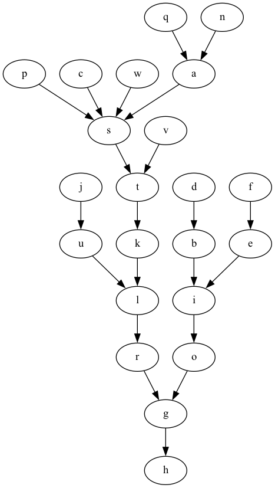

# Linked List Intersections Exercise

Given a graph described as a series of edge of the form `a -> b`, and a series of graph starting points of the form `c,d,e`, for each set of start points, identify if the graphs from the starting points intersect. Return true if any of the graphs from the starting points intersect, false if there are no intersections from the graphs of any of the starting points. Graphs are directed, and each node may only traverse to one other node.  Beware that not all graphs connect, and loops are possible.

Sample graphs and their visualizations are available in the [samples](samples/) folder.

## Detecting Loops

There are a couple of mechanisms for detecting loops.

### Without Allocating Memory

If you have two points looking at the graph, and start them from the same pont, advance one of them one step in the graph, while advancing the other one two steps in the graph. If the lead viewer can't advance two steps, you can stop and there are no loops.  If after moving the lead viewer is looking at the same node in the graph as the trailing viewer, the graph has a loop.

### Allocating Memory

For each starting point, record in a set each node that is visited. Before adding a new node to the set, see if that node already exists in the set. If the node exits, there is a loop. You can stop adding nodes to the set beacuse you have already identified all unique nodes.